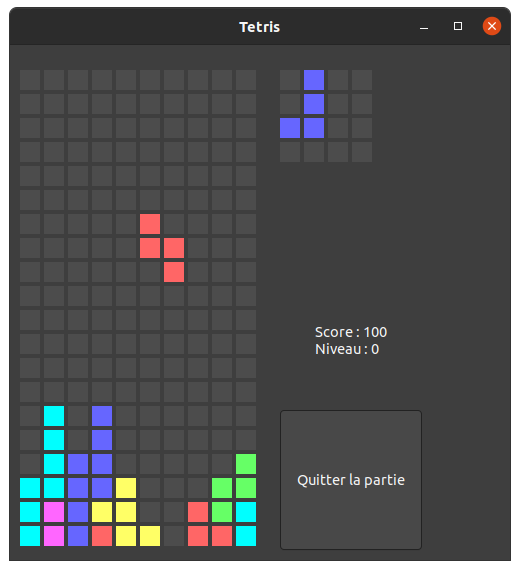
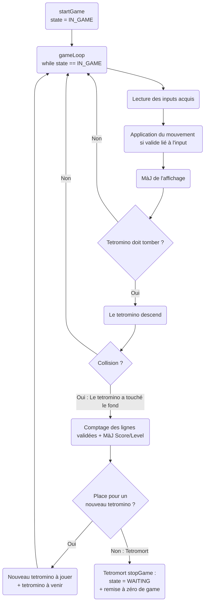
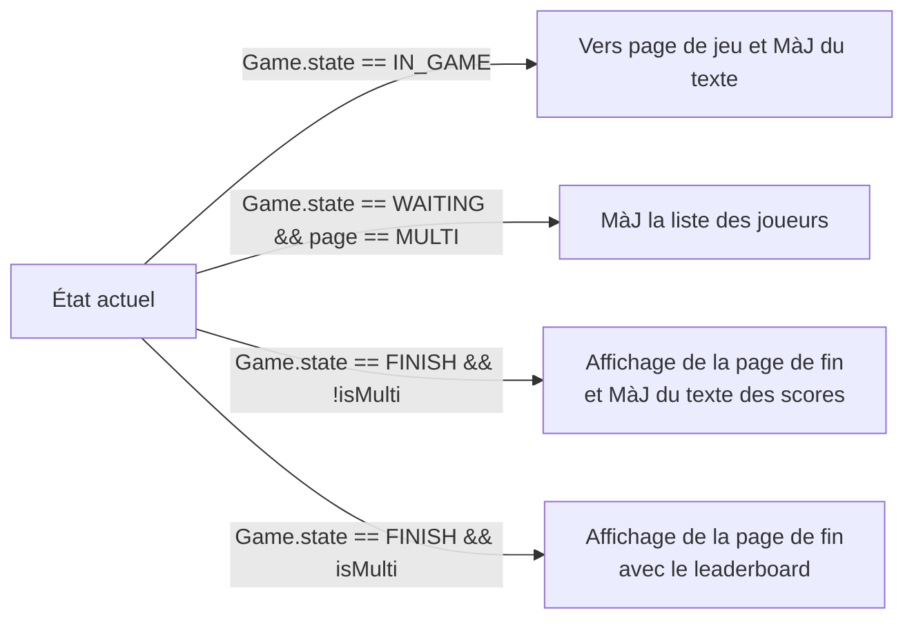
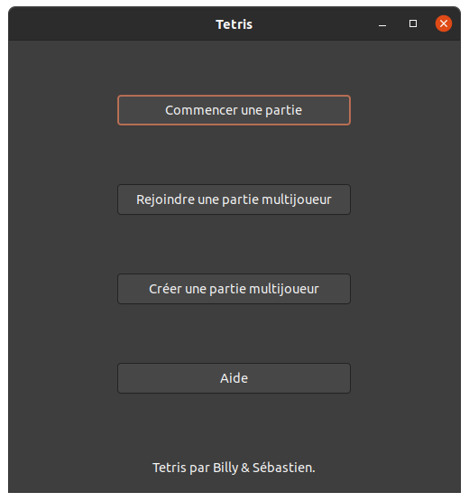
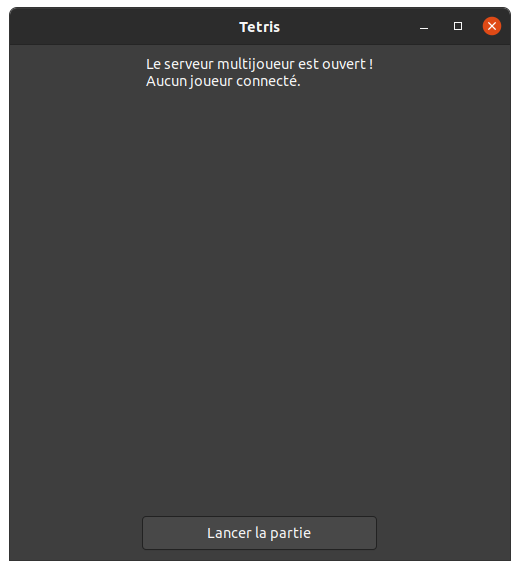
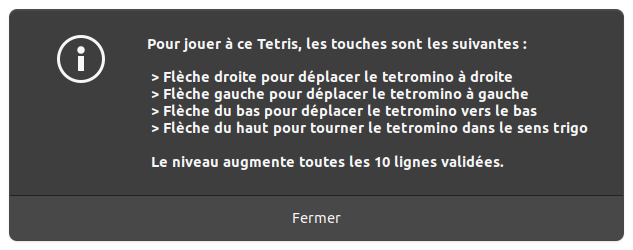
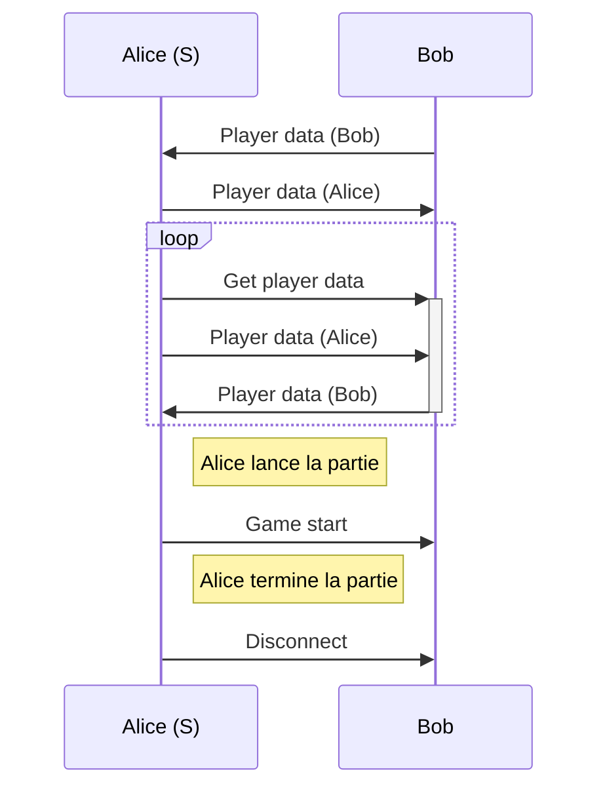
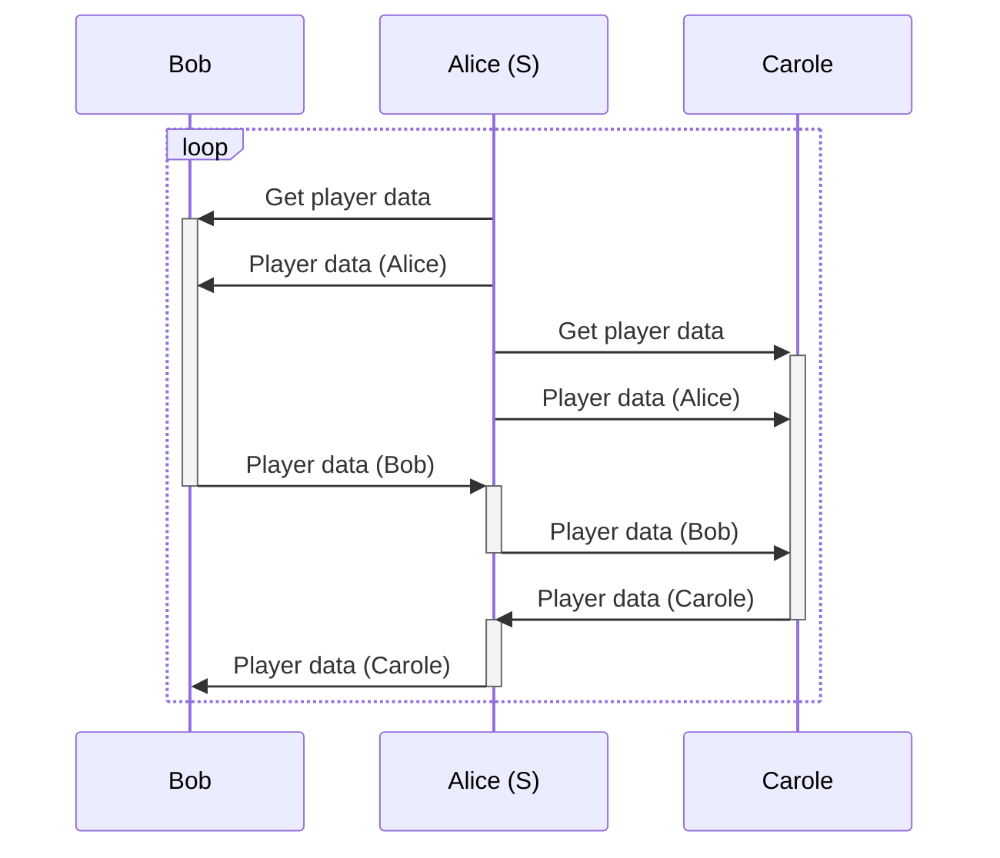

# tetris

This is a beautiful tetris that you'll be able to play in multiplayer!



# Development

## Use-Case

* The user can start a game. Then the tetris grid appears and some random pieces (I, O, T, L, J
Z, S) are generated. The player can move the piece horizontally and rotate them and every tick the
piece goes down. When the piece collides with either the floor or another piece, it stops and is
blocked in place and a new piece is generated at the top of the grid. Every time a line is full
it is remove and the player earn points (more points if multiples lines are removed at the same 
time). Points allow the player to gain levels, the more the levels is high the more the pieces
fall rapidly. 
* The user can start a multiplayer game. Then other players can join the game and play along.
The pieces generated will be the same for all the players.

## Functional Design

* start the game
* Generate random pieces (in a way that would be easy to transmit on a network)
* The game routine : the piece fall and the player control the movements
* Remove the complete lines and add points to the score

* start a multiplayer game
* Retrieve the status of the game
* The server can send the random generator and start the game

## How it works
















# Installation

You need at least cmake version 3.16

Install GTK :
- `sudo apt install libgtkmm-3.0-dev`

# Build

```bash
mkdir build; cd build

cmake ..
make
./tetris
```

# Useful links

- [gtkmm with CMake](https://stackoverflow.com/questions/46791091/how-to-set-up-cmakelists-with-gtk)
